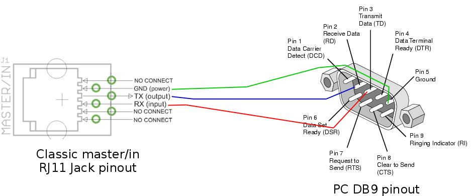

# ModbusAdapter
ESP32 Modbus Wifi TCP-RTU adapter

Adds Modbus TCP over WIFI to an RTU RS232 device

## Wiring

RS232 Interface Module | ESP32 |
--- | --- |
VCC | 3.3V |
RX | GPIO16 (RX2) |
TX | GPIO17 (TX2)|
Gnd | Gnd |

  

  

