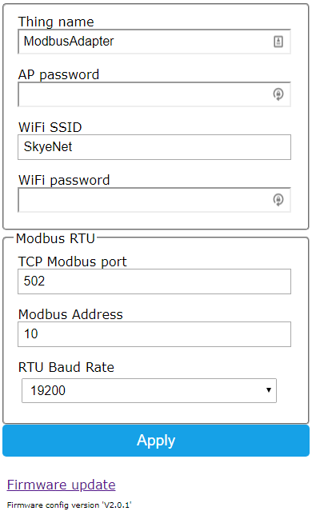

<h1>ModbusAdapter</h1>
<h2>Adds Modbus TCP over WIFI to a Modbus RTU Serial device</h2>

|If you find this project useful or interesting, please help support further development!|{:target="_blank"}|
|---|---|

Please refer to the <a href="https://github.com/ClassicDIY/ModbusAdapter/wiki">ModbusAdapter wiki</a> for more information.

<h2>Parts</h2>

|<a href="https://www.aliexpress.com/item/32826540261.html?src=google&src=google&albch=shopping&acnt=494-037-6276&isdl=y&slnk=&plac=&mtctp=&albbt=Google_7_shopping&aff_platform=google&aff_short_key=UneMJZVf&&albagn=888888&albcp=7386552844&albag=80241711349&trgt=743612850714&crea=en32826540261&netw=u&device=c&albpg=743612850714&albpd=en32826540261&gclid=Cj0KCQjw-r71BRDuARIsAB7i_QMqV6A_E4zdDcSiXs2j3qIUm4cIgdCFfkDs1Egmak4QgCXrvfcQXAkaAu2WEALw_wcB&gclsrc=aw.ds"> ESP32 Dev Module</a>||
|---|---|
|<a href="https://www.canakit.com/rs232-interface-module-ck1007-uk1007.html"> RS232 Interface Module </a>||

<h2>Wiring diagram</h2>

RS232 Interface Module | ESP32 |
--- | --- |
VCC | 3.3V |
RX | GPIO16 (RX2) |
TX | GPIO17 (TX2)|
Gnd | Gnd |

  

<h2>RJ11 to male DE-9 connector Cable</h2>

  

<h2>ModbusAdapter home page</h2>

  

<h2>ModbusAdapter configure page</h2>
 *** Use admin/ModbusAdapter to access setup
 

  

 ### Use the ClassicMonitor android app to view your data
 
 *** Connect to the ModbusAdapter IP Address
 

